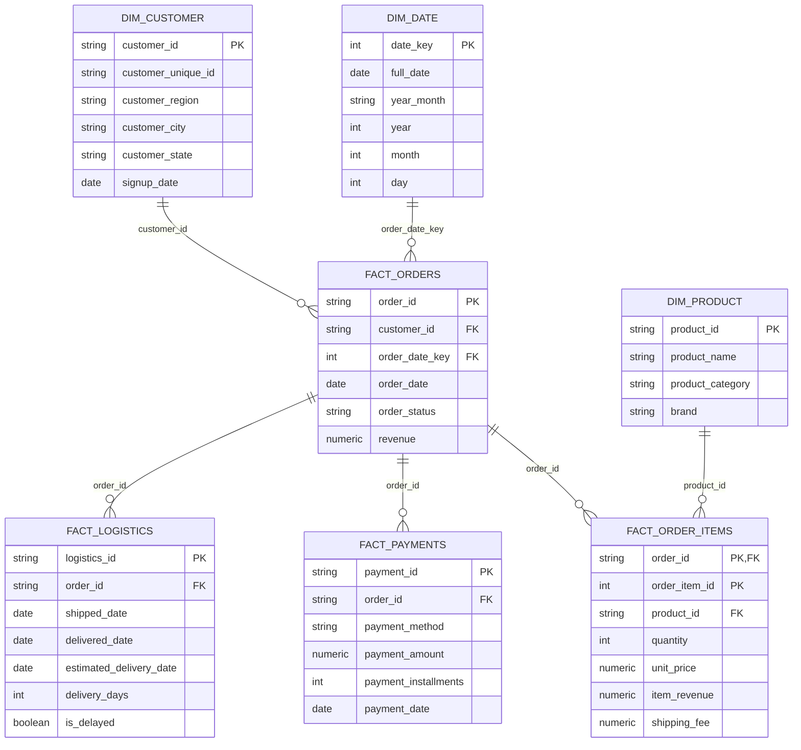

# Order Domain 표준 컬럼 상세 정의서

```
본 문서는 이커머스 데이터 분석을 위한 표준 컬럼 상세 정의를 목적으로 하며,
Order Domain(주문 기반 데이터)을 기준으로 컬럼을 정의합니다.

Order Domain은 KPI, 코호트, RFM, 상품 분석 등
핵심 분석 모듈의 기준이 되는 데이터 영역으로,
본 프로젝트의 분석 수행을 위한 핵심 구조를 구성합니다.

본 정의서는 MVP 단계 기준으로 작성되었으며,
향후 Event, Experiment 등 신규 분석 도메인은 별도의 표준 컬럼 정의서를 통해 확장됩니다.

아래 작성된 ERD는 Order Domain의 논리 구조를 Fact / Dimension 기준으로 표현한 것입니다.  
실제 물리 테이블 구조는 Data Mart 설계 단계에서 조정될 수 있습니다.
```




---

## 1. 문서 목적

```
본 문서의 목적은 다음과 같습니다.

- 다양한 이커머스 주문 데이터를 공통된 표준 컬럼 구조로 변환
- 컬럼 자동 매핑, 전처리, 분석 가능 여부 진단의 기준으로 사용
- KPI, 코호트, RFM, 상품 분석 등에 필요한 최소 컬럼과 확장 컬럼을 구분
- Raw → Staging → Data Mart → Analytics 흐름에서 일관된 컬럼 기준을 유지
```


---

## 2. 설계 원칙

```
본 문서의 설계 원칙은 다음과 같습니다.

- Core 컬럼은 MVP 분석 수행에 필요한 최소 기준으로 유지
- 확장 컬럼은 분석 가능 범위를 넓히기 위한 선택 컬럼으로 관리
- Derived 컬럼은 원본 데이터에서 직접 요구하지 않고 분석 또는 Data Mart 단계에서 생성
- 컬럼 정의는 이후 컬럼 매핑 정책, 전처리 정책, Data Mart 설계의 기준으로 사용
```


---

## 3. 컬럼 분류 체계

```
본 문서는 Order Domain 기준으로 컬럼을 다음과 같이 분류합니다.

  
※ 본 분류 체계는 Order Domain 기준이며,  
Event, Experiment 등 확장 도메인은 별도의 분류 체계를 가집니다.
```

| 분류        | 설명                    |
| --------- | --------------------- |
| Core      | 주문 기반 분석의 핵심 컬럼       |
| Customer  | 고객 식별 및 고객 분석 관련 컬럼   |
| Product   | 상품 및 카테고리 분석 관련 컬럼    |
| Payment   | 결제 및 매출 검증 관련 컬럼      |
| Logistics | 배송 및 주문 상태 등 운영 관련 컬럼 |
| Derived   | 분석 과정에서 생성되는 파생 컬럼    |


---

## 4. Core 컬럼 상세 정의


#### 4.1 order_id

| 항목     | 내용                   |
| :----- | -------------------- |
| 컬럼명    | `order_id`           |
| 설명     | 주문을 식별하는 고유 ID       |
| 분류     | Core                 |
| Grain  | Order                |
| 데이터 타입 | STRING               |
| 필수 여부  | 필수                   |
| 사용 분석  | KPI, 코호트, RFM, 상품 분석 |
| 생성 기준  | 원본 데이터의 주문 ID 컬럼을 매핑 |
| 예시     | ORD_10001            |
| 비고     | NULL 불가, 중복 불가       |

#### 4.2 order_date

| 항목     | 내용                         |
| :----- | -------------------------- |
| 컬럼명    | `order_date`               |
| 설명     | 주문이 발생한 날짜 또는 일시           |
| 분류     | Core                       |
| Grain  | Order                      |
| 데이터 타입 | DATE / DATETIME            |
| 필수 여부  | 필수                         |
| 사용 분석  | KPI(기간별), 코호트, RFM, 시계열 분석 |
| 생성 기준  | 원본 데이터의 주문일자 컬럼을 매핑        |
| 예시     | 2024-01-15                 |
| 비고     | 문자열 날짜는 반드시 DATE 타입으로 변환   |

#### 4.3 customer_id

| 항목     | 내용                   |
| :----- | -------------------- |
| 컬럼명    | `customer_id`        |
| 설명     | 고객을 식별하는 ID          |
| 분류     | Core / Customer      |
| Grain  | Order / Customer     |
| 데이터 타입 | STRING               |
| 필수 여부  | 필수                   |
| 사용 분석  | 코호트, RFM, 고객 분석      |
| 생성 기준  | 원본 데이터의 고객 ID 컬럼을 매핑 |
| 예시     | CUST_001             |
| 비고     | NULL일 경우 고객 기반 분석 불가 |

#### 4.4 revenue

| 항목     | 내용                                                     |
| :----- | ------------------------------------------------------ |
| 컬럼명    | `revenue`                                              |
| 설명     | 주문 또는 주문 상품 기준 매출 금액 (분석 기준에 따라 정의)                    |
| 분류     | Core                                                   |
| Grain  | Order / Order Item                                     |
| 데이터 타입 | NUMERIC                                                |
| 필수 여부  | 필수                                                     |
| 사용 분석  | 매출 KPI, AOV, RFM                                       |
| 생성 기준  | `payment_amount` 또는  (`unit_price` x `quantity`) 기반 생성 |
| 예시     | 350000                                                 |
| 비고     | 취소/환불 데이터 처리 기준 필요                                     |


---

## 5. Product 컬럼 정의


| 컬럼명                | 설명             | Grain                | 필수 여부        | 사용 분석          |
| ------------------ | -------------- | -------------------- | ------------ | -------------- |
| `product_id`       | 상품 식별 ID       | Product / Order Item | 상품 분석 시 필수   | 상품 분석, 카테고리 분석 |
| `product_name`     | 상품명            | Product              | 선택           | 상품별 성과 조회      |
| `product_category` | 상품 카테고리        | Product              | 카테고리 분석 시 필수 | 카테고리 분석        |
| `brand`            | 상품 브랜드         | Product              | 선택           | 브랜드별 분석        |
| `quantity`         | 주문 상품 수량       | Order Item           | 선택           | 판매량 분석         |
| `unit_price`       | 상품 단가          | Order Item           | 선택           | 상품 매출 분석       |
| `item_revenue`     | 주문 상품 단위 매출 금액 | Order Item           | 상품 분석 시 필수   | 상품 매출 분석       |


---

## 6. Customer 컬럼 정의


| 컬럼명                  | 설명             | Grain            | 필수 여부 | 사용 분석              |
| -------------------- | -------------- | ---------------- | ----- | ------------------ |
| `customer_id`        | 고객 식별 ID       | Customer / Order | 필수    | 코호트, RFM, 고객 분석    |
| `customer_unique_id` | 동일 고객 통합 식별 ID | Customer         | 선택    | 재구매 분석, 고객 생애가치 분석 |
| `customer_region`    | 고객 지역          | Customer         | 선택    | 지역별 고객 분석          |
| `customer_city`      | 고객 도시          | Customer         | 선택    | 도시별 고객 분석          |
| `customer_state`     | 고객 주/도 단위 지역   | Customer         | 선택    | 지역별 매출 분석          |
| `signup_date`        | 고객 가입일         | Customer         | 선택    | 가입 코호트 분석          |


---

## 7. Payment 컬럼 정의


| 컬럼명                    | 설명          | Grain           | 필수 여부      | 사용 분석        |
| ---------------------- | ----------- | --------------- | ---------- | ------------ |
| `payment_id`           | 결제 기록 식별 ID | Payment         | 선택         | 결제 정합성 검증    |
| `order_id`             | 주문 식별 ID    | Payment / Order | 필수         | 주문-결제 연결     |
| `payment_method`       | 결제 수단       | Payment         | 선택         | 결제 수단별 분석    |
| `payment_amount`       | 결제 금액       | Payment         | 결제 분석 시 필수 | 매출 검증, 결제 분석 |
| `payment_installments` | 할부 개월 수     | Payment         | 선택         | 결제 조건 분석     |
| `payment_date`         | 결제 발생 일자    | Payment         | 선택         | 결제 시점 분석     |


---

## 8. Logistics 컬럼 정의


| 컬럼명                       | 설명             | Grain                  | 필수 여부      | 사용 분석          |
| ------------------------- | -------------- | ---------------------- | ---------- | -------------- |
| `order_status`            | 주문 상태          | Order                  | 선택         | 취소율, 유효 주문 필터링 |
| `logistics_id`            | 배송/물류 기록 식별 ID | Logistics              | 선택         | 배송 기록 식별       |
| `shipped_date`            | 출고일            | Logistics              | 선택         | 출고 리드타임 분석     |
| `delivered_date`          | 배송 완료일         | Logistics              | 배송 분석 시 필수 | 배송 리드타임 분석     |
| `estimated_delivery_date` | 예상 배송 완료일      | Logistics              | 선택         | 배송 지연 분석       |
| `delivery_days`           | 배송 소요일         | Logistics              | 선택         | 배송 리드타임 분석     |
| `is_delayed`              | 배송 지연 여부       | Logistics              | 선택         | 배송 지연율 분석      |
| `shipping_fee`            | 배송비            | Order Item / Logistics | 선택         | 배송비 분석         |


---

## 9. Derived 컬럼 정의

```
Derived 컬럼은 원본 데이터에 직접 존재하지 않고,  
분석 수행을 위해 생성되는 파생 컬럼입니다.

본 컬럼들은 Data Mart 또는 Analytics 단계에서 생성되며,  
분석 목적에 따라 추가 또는 변경될 수 있습니다.
```

| 컬럼명 | 설명 | 생성 기준 | 사용 분석 |
|---|---|---|---|
| year_month | 주문 기준 월 (YYYY-MM) | order_date → YYYY-MM 변환 | KPI, 코호트 |
| cohort_month | 고객 첫 구매 월 | 고객별 MIN(order_date) | 코호트 분석 |
| recency | 마지막 구매 이후 경과일 | 기준일 - 마지막 주문일 | RFM 분석 |
| frequency | 고객 구매 횟수 | COUNT(order_id) | RFM 분석 |
| monetary | 고객 총 구매 금액 | SUM(revenue) | RFM 분석 |
| aov | 평균 주문 금액 | SUM(revenue) / COUNT(order_id) | KPI 분석 |
| order_count | 특정 기간 주문 수 | 기간별 COUNT(order_id) | KPI 분석 |
